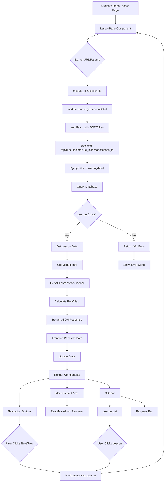
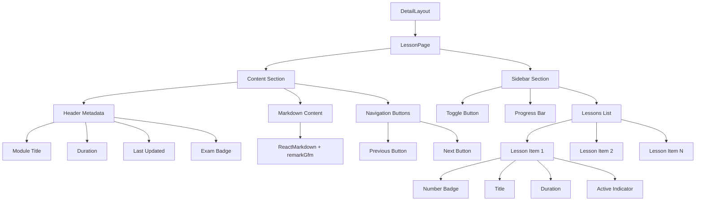
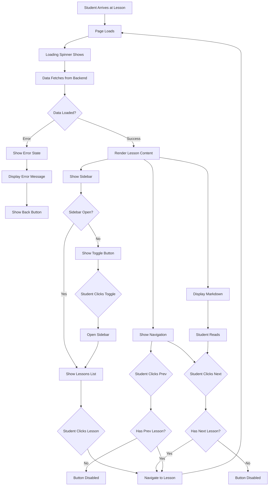
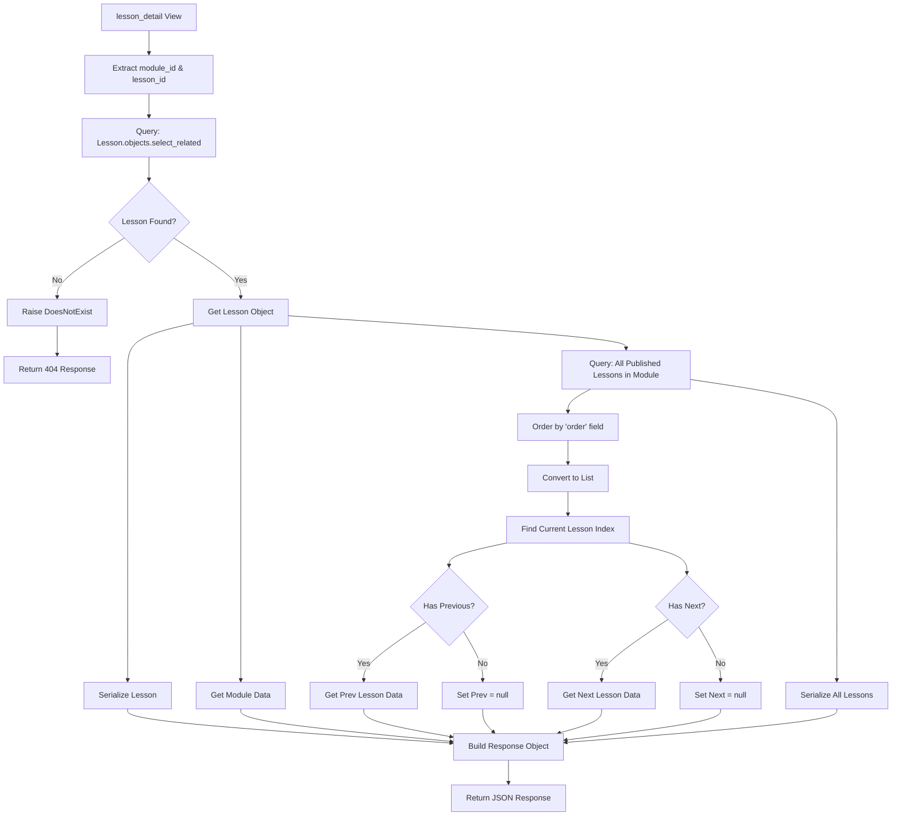
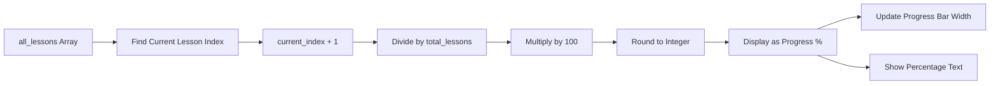
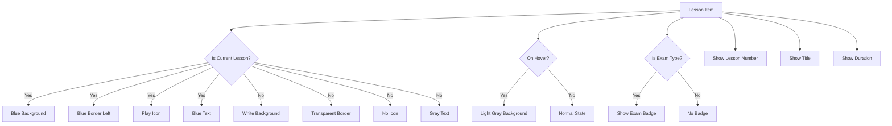

# Student Lesson Page - Architecture Diagram

## Data Flow



## Component Structure



## State Management

```mermaid
graph LR
    A[Component Mount] --> B[useState Hooks]
    
    B --> C[sidebarStatus: boolean]
    B --> D[loading: boolean]
    B --> E[error: string | null]
    B --> F[lessonData: LessonDetailResponse | null]
    
    G[useEffect] --> H{URL Params Valid?}
    H -->|No| I[Set Error]
    H -->|Yes| J[Fetch Data]
    
    J --> K[Set Loading = true]
    K --> L[API Call]
    L --> M{Success?}
    
    M -->|Yes| N[Set lessonData]
    M -->|No| O[Set Error]
    
    N --> P[Set Loading = false]
    O --> P
    
    C --> Q[Toggle Sidebar]
    D --> R[Show Loading Spinner]
    E --> S[Show Error Message]
    F --> T[Render Content]
```

## API Response Structure

```mermaid
graph TD
    A[LessonDetailResponse] --> B[success: boolean]
    A --> C[lesson: Lesson]
    A --> D[module: ModuleInfo]
    A --> E[navigation: Navigation]
    A --> F[all_lessons: Lesson Array]
    
    C --> G[id, title, content]
    C --> H[lesson_type, order]
    C --> I[duration_minutes]
    C --> J[is_published]
    C --> K[dates]
    
    D --> L[id, title]
    D --> M[description]
    D --> N[cover_image]
    
    E --> O[prev: Lesson | null]
    E --> P[next: Lesson | null]
    
    F --> Q[Array of all lessons]
    Q --> R[For sidebar display]
```

## User Interaction Flow



## Backend Query Flow



## Progress Calculation



## Sidebar Lesson Item States



These diagrams illustrate the complete architecture and flow of the student lesson page implementation.
